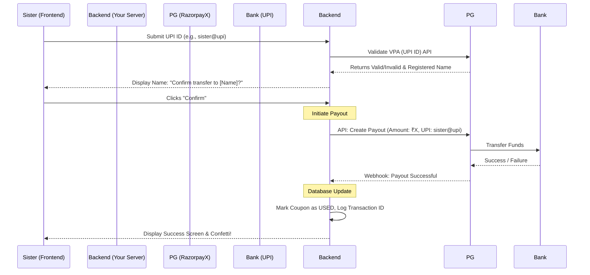

# Raksha Bandhan Quiz App: Payment Integration Workflow

This document outlines the workflow and architecture for building a quiz app where users (sisters) win money for correct answers and receive the payout via UPI or Phone Number.

> [!IMPORTANT]
> Since you are **sending** money to users rather than receiving it, you need a **Payout** or **Disbursement** API. Standard payment gateways (like standard Razorpay or Stripe) are for *collecting* money. For sending money in India (via UPI), you should use **RazorpayX** or **Cashfree Payouts**.

## System Components
1. **Frontend App:** The UI where the quiz is played, coupons are entered, and UPI IDs are submitted.
2. **Backend Server:** A secure server (Node.js, Java, Python, etc.) that validates coupons, calculates scores, and talks to the Payment Gateway.
3. **Database:** Stores valid coupons, their usage status (`UNUSED`, `IN_PROGRESS`, `USED`), and transaction logs.
4. **Payment Gateway (PG):** The service that actually moves the money (e.g., RazorpayX).

---

## The Workflow

### Phase 1: Setup & Pre-funding (Admin / Brother)
1. You (the admin) generate secure, single-use coupon codes and store them in your Database with status `UNUSED`.
2. You create an account with a Payout provider (like RazorpayX).
3. You deposit a lump sum of money (e.g., ₹5,000) into your RazorpayX virtual account. This acts as the "wallet" from which sisters will be paid.

### Phase 2: Authentication & Gameplay (User / Sister)
1. **Login:** The sister opens the app and is prompted for a coupon code.
2. **Validation:** The Frontend sends the code to the Backend.
3. **Check:** Backend checks the Database. If the code is `UNUSED`, it grants access and temporarily marks it as `IN_PROGRESS` (so it can't be used twice simultaneously).
4. **Quiz:** The sister plays the quiz. The Frontend calculates the score and sends the final result securely to the Backend.
   > [!WARNING]  
   > Never trust the frontend to calculate the final money amount. The backend should ideally verify the answers to prevent cheating/hacking.

### Phase 3: Payout Integration (The Money Transfer)

### Detailed Step-by-Step of Phase 3

1. **UPI Input:** The sister enters her UPI ID (e.g., `9876543210@paytm`).
2. **VPA Validation (Optional but Recommended):** 
   * Your backend calls the PG's "Validate VPA" API. 
   * The PG checks if the UPI ID exists and returns the real name associated with it. 
   * The app shows: *"Are you sure you want to send ₹500 to **Neha Sharma**?"* to prevent typos.
3. **Trigger Payout:** 
   * Once confirmed, your Backend makes a server-to-server API call to the PG's Payout endpoint.
   * *Payload includes:* Amount, UPI ID, Currency (INR), and a unique Reference ID (like the coupon code).
4. **Webhook Confirmation:** 
   * The PG processes the transfer and sends an asynchronous "Webhook" (a silent background message) to your Backend saying the money was successfully deposited.
5. **Finalize:** 
   * Your Backend permanently marks the coupon as `USED` in the database so it can never be used again.

---

## Security Considerations

> [!CAUTION]
> When dealing with automated money transfers, security is the highest priority.

1. **Rate Limiting:** Ensure your backend limits how many times an IP address can attempt to enter a coupon or request a payout to prevent brute-force attacks.
2. **Server-Side Secrets:** Your API keys for the Payment Gateway must NEVER be placed in the frontend code. Only the Backend should communicate with the PG.
3. **Idempotency:** When making the Payout API call, use an "Idempotency Key" (a unique ID for that specific transaction). This ensures that if there's a network glitch and your backend sends the payment request twice by accident, the PG only transfers the money *once*.
4. **State Management:** If a sister gets disconnected midway, the coupon should eventually reset from `IN_PROGRESS` back to `UNUSED` after a timeout (e.g., 30 minutes) if no payout was completed.
